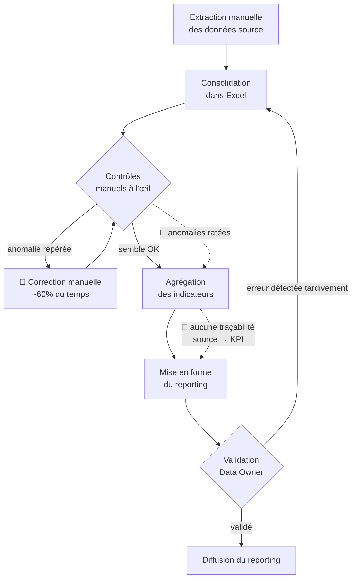

# Process as-is — Production manuelle du reporting risque de crédit

Chaîne actuelle et points de friction (🔴 = coût / risque).

**Points de douleur identifiés**
1. 🔴 Corrections manuelles répétées (~60% du temps) — cf. note de cadrage.
2. 🔴 Contrôles non exhaustifs → anomalies qui passent en aval.
3. 🔴 Aucune traçabilité source → indicateur (non-conformité BCBS 239 principe 6).
4. 🔴 Boucles de re-travail quand l'erreur est vue à la validation finale.

Le process **to-be** (P4) remplace les étapes C/D/E par un pipeline dbt à contrôles
bloquants + lineage automatique.
